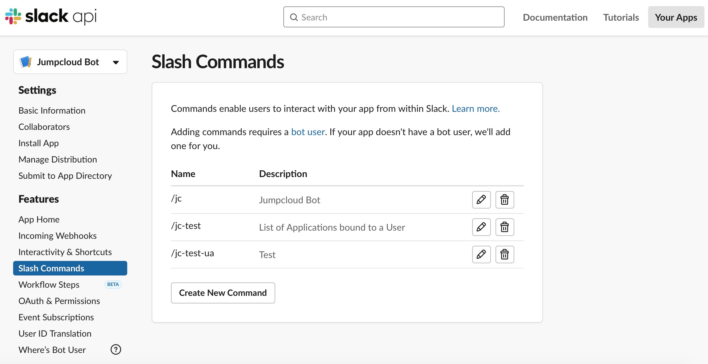

# Jumpcloud Slackbot
This project helps to create a Slack bot to interact with Jumpcloud APIs via slash commands without the need of giving access to Jumpcloud Admin console to your users. 

## Requirements
The project uses  
- JDK 8  
- PostgreSQL  
- AWS Secret Manager  
Alternatively, you can choose to bypass AWS Secret Manager and store secrets on the 
secrets file.  

## Installation
Clone the git repository with the following command.  
`git clone repository-url`  

Create a .yml file for development and production in `resources` folder using the template below.  

    spring:  
      datasource:  
        driver-class-name: org.postgresql.Driver  
        username: <database-username>  
        password: <database-password>  
        url: <database-url>  
      flyway:  
        locations: classpath:db/migration  
        schemas: public  
        enabled: true  
    jc-api-key: <jumpcloud-api-key>  
    slack-signing-secret: <slack-signing-secret>  
    slack-token: <slack-token>  
    allowed-channels: <allowed-slack-channels-which-commands-can-be-called>  
    base-command: <base-command>  
    domain: <organisation-domain>  
    aws:  
      secretName: <aws-secret-name>  
      region: <aws-region>  

In your SQL database, populate the admin table as shown in `resources/db.migration/V1_init.sql`.  

To add a slack base-command to Slack api, create an application at `api.slack.com` with the organisation's 
account and set a slash command under `features/slash commands`.  

  

You can use multiple slash commands so multiple developers can connect to different 
base-command and develop at the same time.  

Remember to enable the Escape channels, users, and links sent to your app so that 
the mentions of slack users `e.g @shiying.tey` for user-specific commands would 
work with mentions.  

  

In the allowed Slack Channel, all commands can be invoked with the base slash command 
followed by action and parameters required for the action separated by space. Implemented 
commands are as follows:

| Action        | Params          | Example  | Description |
| ---------- | ----------- | ---------------- | ---------- |
| `add-user-group` | `user-email` `user-group-name` | /base-command `add-user-group` example@organisation.com group-name OR /base-command `add-user-group` @user group-name| Add a `User` to a `User Group` |
| `add-system`      | `system-name` `system-group-name` |/base-command `add-system` system-name system-group-name OR   /base-command `add-system` system-Id system-group-name  | Add a `System` to a `System Group`|
| `bind-system-user` | `user-email` `system-name` | /base-command `bind-system-user` example@fundingsocieties.com system-name OR   /base-command `bind-system-user` @user system-name OR   /base-command `bind-system-user` example@fundingsocieties.com system-Id OR   /base-command `bind-system-user` @user system-Id| Bind a `System` to a `User` |
| `disable-system-totp-login`      | `user-email`  |/base-command  `disable-system-totp-login` example@fundingsocieties.com OR   /base-command  `disable-system-totp-login` @user  | Disable `System TOTP MFA` on login|
| `enable-system-totp-login` | `user-email` | /base-command `enable-system-totp-login` example@fundingsocieties.com OR /base-command `enable-system-totp-login` @user| Enable `System TOTP MFA` on login|
| `list-all-user-group`      |  |/base-command `list-all-user-group`  | Global list of `user groups`|
| `list-all-system-group` |  | /base-command `list-all-system-group`| Global list of `system groups` |
| `list-user-info`      | `user-email` |/base-command `list-user-info` example@fundingsocieties.com OR   /base-command `list-user-info` @user | List all `predefined JumpCloud attributes` of a `User` account|
| `list-user-attributes` | `user-email`  | /base-command `list-user-attributes` example@fundingsocieties.com OR   /base-command `list-user-attributes` @user| List all `custom attributes` of a `User` account|
| `list-user-group`      | `user-email`|/base-command `list-user-group` example@fundingsocieties.com OR   /base-command `list-user-group`  @user | List `User Groups` that a `User` is part of|
| `list-system` | `user-email` | /base-command `list-system` example@fundingsocieties.com OR  /base-command `list-system` @user| List `Systems` bound to a `User` |
| `list-system-info`      | `system-name` |/base-command list-system-info system-name OR   /base-command list-system-info system-Id| List `info` of a `System`|
| `list-app-bound-user` | `user-email` | /base-command `list-app-bound-user` example@fundingsocieties.com OR   /base-command `list-app-bound-user` @user| List `Applications` bound to a `User`|
| `list-user-bound-system`      | `system-name` |/base-command `list-user-bound-system` system-name OR   /base-command `list-user-bound-system` system-Id| List `Users `bound to a `System`|
| `list-user-bound-app` | `app-name`  | /base-command `list-user-bound-app` application-name | List `Users` bound to an `Application` |
| `help`      | |/base-command `help` | List `description` and `example` of `all commands`|
| `help` | `command`  |/base-command `help` `list-user-bound-app`| List `description` and `example` of a `specific command`
| `remove-user-group`      | `user-email` `user-group-name` |/base-command `remove-user-group` example@fundingsocieties.com group-name OR   /base-command `remove-user-group` @user group-name | Remove a `User` from a `User Group`|
| `remove-system` | `system-name` `system-group-name` | /base-command `remove-system` system-name system-group-name OR /base-command `remove-system` system-Id system-group-name| Remove a `System` from a `System Group` |
| `reset-mfa`      | `user-email` `exclusion-period` |/base-command `reset-mfa` example@fundingsocieties.com 7 OR   /base-command `reset-mfa` @user 7  | Reset `MFA token` for a `User` with exclusion period for MFA in days |
| `unbind-system-user` | `user-email` `system-name` | /base-command `unbind-system-user` example@fundingsocieties.com system-name OR   /base-command `unbind-system-user` @user system-name OR   /base-command `unbind-system-user` example@fundingsocieties.com system-Id OR   /base-command `unbind-system-user` @user system-Id| Un-Bind a `System` from a `User`|
| `user-unlock`      | `user-email`  |/base-command `user-unlock` example@fundingsocieties.com OR   /base-command `user-unlock` @user | Unlock a locked `User`|

## Resources
https://docs.jumpcloud.com/1.0/api-overview/v1-api  
https://docs.jumpcloud.com/2.0/api-overview/v2-api  
https://github.com/TheJumpCloud/jcapi-java/tree/master/jcapiv1  
https://github.com/TheJumpCloud/jcapi-java/tree/master/jcapiv2  
https://api.slack.com/scopes  